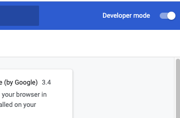
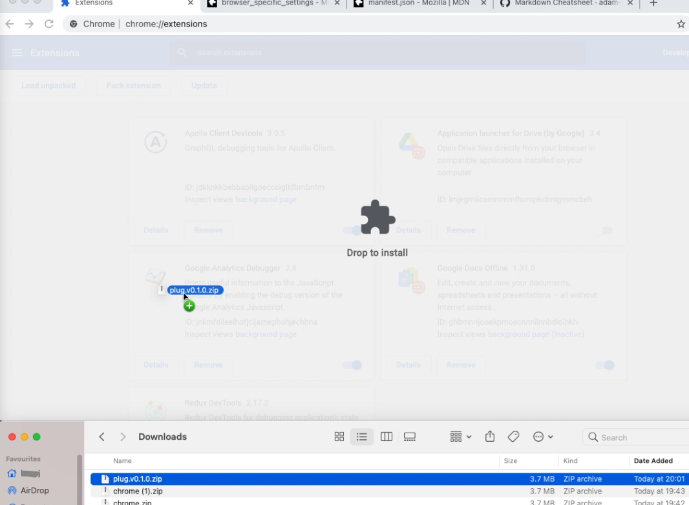
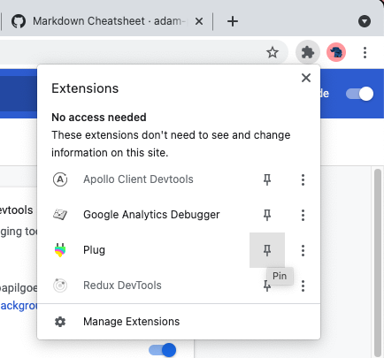

# Install Plug in Chrome

The Plug Chrome Extension (used for `edge` and `brave` as well) is currently installed from a developer build.

## Download the latest version of plug 

Download the latest plug extension zip  from the our Github [releases page](https://github.com/Psychedelic/plug/releases):

## Open Chrome extensions

Open Chrome and navigate to the chrome extensions bar by typing [chrome://extensions](chrome://extensions) into the address bar.

## Enable Developer Mode

To install a developer extension build, developer mode must be enabled by checking the `Developer mode`  option on the top right of the extensions page.

## Load the Extension

Drag the downloaded plug zip file, from the download folder over the chrome extensions page.

## Pin Plug

Plug is now installed and can be pinned against the address bar.

Congratulations, Plug is now installed and good to go.
