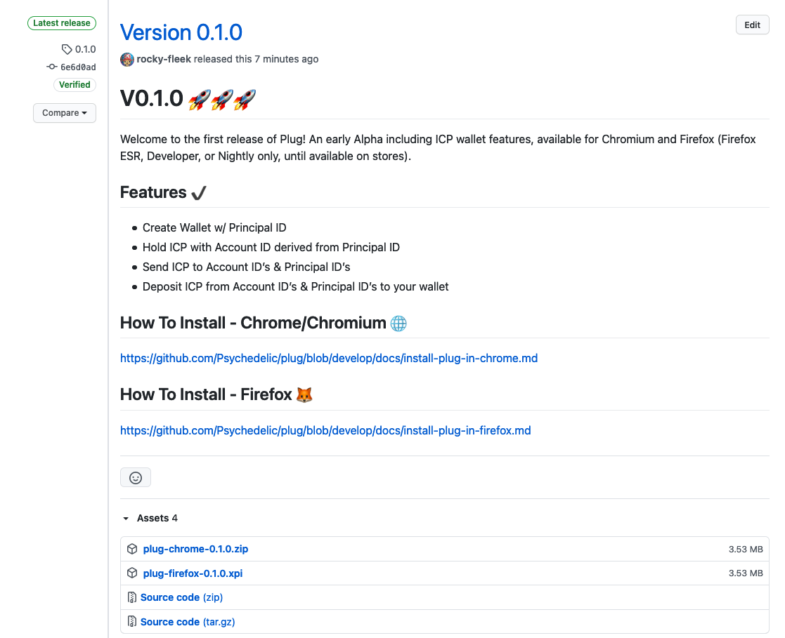

# Install Plug in Firefox

The Plug Firefox addon is currently installed from a developer build.

> **NOTE:** Firefox only allows the installation of temporary developer extensions (they will not persist between firefox restarts). You may wish to install plug with Chrome until it becomes available in Firefox addons as a signed extension. An alternative is to use the Firefox Developer or Nightly editions and turn off the [extension signing requirement](http://mzl.la/1J7Lcsp).

## Download the latest version of plug 

Download (right click and `Save Link As...`) the latest plug firefox xpi file from the our Github [releases page](https://github.com/Psychedelic/plug/releases):

## Open the Firefox Debugging Page

Plug must be installed as a temporary extension via the [about:debugging](about:debugging#/runtime/this-firefox) page.

Open Firefox and in the address bar type `about:debugging`

Click `This Firefox` to see the `Temporary Extensions` list.

## Load the extension

Install the Plug extension by clicking the `Load Temporary Add-on...` button and selecting the plug xpi file you previously downloaded.

Congratulations, Plug is now installed and good to go; you should be able to see it in the address bar.

